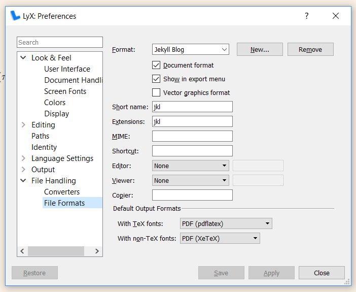
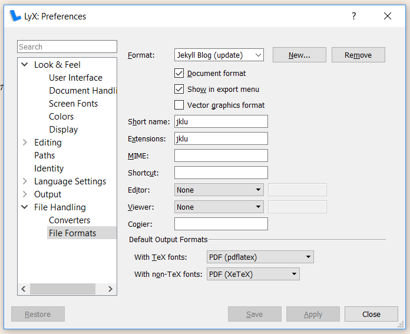
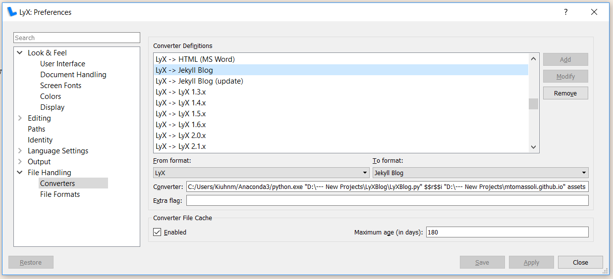
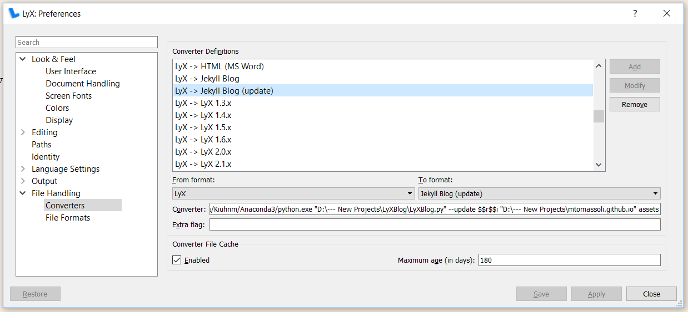

# About

This is a little script which converts a LyX file into an HTML file and "publishes" it on a [local copy](#start-blogging) of your Jekyll-based blog. This script can be [integrated](#integration) in LyX.

# Features

*LyXBlog* supports:
- images with or without captions
- math through *MathJax*
- bibliography
- labels for equations, sections, images
- custom labels (`\label{label_name{text_when_referenced}}`)
- *style* attribute for injecting `<style>...</style>` in HTML
- *raw blocks* for injecting raw text such as *Jekyll*-specific tags (e.g. ``)

# Usage

`LyXBlog [--update] [--args_from_file] <input file> <blog base dir> <assets relative dir>`

where:

* `--update` is used when you want to update an article and it's OK to overwrite existing files
* `--args_from_file` lets you drop the last two arguments (`<blog base dir> <assets relative dir>`) and specify them in the front matter of the input file
* `input file` is the LyX file to publish
* `blog base dir` is the base dir of the local copy of your blog (e.g. `c:\my_projects\blog`)
* `assets relative dir` is the relative dir (e.g. `assets`) of the directory where to put the images

# Requirements

`lyx.exe` and `pandoc.exe` must be in your *search path* and the script requires **Python 3**.

# Dependencies

* pandocfilters
* ruamel_yaml

# Front matter

Every LyX file needs to contain a ***double*** *front matter*. The first part is a front matter for LyxBlog itself and the second one for Jekyll. The second front matter will be copied (almost) *verbatim* into the HTML file.

**IMPORTANT:** You need to insert (as *TeX code* (CTRL-L)) the double front matter between `\begin{comment}` and `\end{comment}`, **right at the beginning of the file**. You need the *package* `verbatim` for the `comment` environment.

Here's an example of double front matter:

```
\begin{comment}
---
html_file_name:        distributional_rl         # required
args:
    blog_base_dir:     D:\--- New Projects\mtomassoli.github.io
    assets_rel_dir:    assets
style: >
          article { text-align: justify; }
          article p { hyphens: auto; }
          figure { margin-top: 1em; margin-bottom: 1em; }
          figure figcaption { text-align: justify; text-align-last: center; margin: 0 5%; }
---
layout:         post
title:          Distributional RL
date:           2017-12-02
summary:        An intuitive explanation of Distributional RL.
---
\end{comment}
```

* `html_file_name` is used by LyXBlog to name the HTML file (but the date will be added to the name as required by Jekyll). Use the basename of the file without any extension just like in the example above.
* `args` is used to supply the last two arguments to LyXBlog when you're using `--args_from_file`.
* `style` is used to inject additional styling information to the final HTML file. I think the ones in the example above are good *defaults*.

# Editing in LyX

See `distributional_rl.lyx` to see what you can do. The only missing feature is the use of labels in paragraphs. You just name the label using the format `some_label_name{the part about distributions}` and then you reference to it with something like

    As we saw in <ref-to-label>
    
This will give you something equivalent to
    
    As we saw in [the part about distributions](link)

# What the script does

The script does the following:

1. converts `article.lyx` to `article.tex` with `lyx.exe`
1. extracts the double front matter from `article.tex` and look for:
    - `html_file_name`
    - `args` (`blog_base_dir`, `assets_rel_dir`)
    - `date` in Jekyll front matter
1. converts `article.tex` to `article.html` with `pandoc.exe`
1. handles the images in article.lyx by copying them to the directory <br>
   `<blog base dir>\<assets relative dir>\<%date>-<%html_file_name>` <br>
   and fixing the references to the images
1. handles all the labels and references
1. adds Jekyll front matter to `article.html`
1. if present, adds the content of the `style` attribute to `article.html`
1. copies the final HTML file into `_post*` with its proper name: <br>
   `<%date>-<%html_file_name>.html`

# <a name="integration"></a>LyX Integration

## Configuring LyX

* Add the package `verbatim` needed for the environment `comment` by going to `Document->Settings...->LaTeX Preamble` and adding the following:
    ```
    \usepackage{verbatim}
    ```
* Go to `Document->Settings...->Language` and select `Unicode (utf8)` under `Encoding`.

## Calling the script from LyX

Go to `Tools->Preferences...` and create the following two (fake) file formats:





Remember to click on *New* and *Apply*.

Then create the following two converters, one with and the other without `--update`:





The field `Converter` deserves an explanation:
- I'm calling `python.exe` with the full path because LyX modifies its private *search path* to make it point to its copy of Python 2.
- If you are on Windows, you need to use "`/`" for the Python path and "`\`" for the other paths. This is a "portability issue", AFAICT.
- `$$r$$i` is the full path of the LyX document.

**NOTE**: If you want, you can drop the last two arguments and use `--args_from_file` instead. This is especially useful if you have more blogs and want to select the destination blog directly in the LyX file.

Remember to click on *Add*, *Apply* and *Save*.

After you've done all that, you can run the script from `File->Export`.

# <a name="start-blogging"></a>An easy way to start blogging on GitHub Pages

## Installation

1. install [ruby](https://www.ruby-lang.org/en/)
2. install [bundler](http://bundler.io/) by executing <br>
   `gem install bundler`
3. fork a [theme](http://jekyllthemes.org/)
4. rename your fork to `<Your GitHub Username>.github.io`
5. clone the fork:<br>
   `git clone https://github.com/<Your GitHub Username>/<Your GitHub Username>.github.io`
6. go inside the local dir of the just-cloned repository
7. execute `bundle install`

Now you can see your local blog by executing `bundle exec jekyll serve` and by going to `http://127.0.0.1:4000`.

## Configuration

* Do not activate MathJax from your theme (if it supports it). That will probably interfere with this script which takes care of MathJax on its own.
* Modify the CSS files of your theme as you see fit. For instance, I reduced the font-size of the code listing and made the margins wider to gain space:
  * in `_code.scss`:
    ```
    pre,
    code {
      font-family: $monospace-font-family;
      font-size: 0.89rem;
    }
    
    figure.highlight {
      margin-left: 0px;
      margin-right: 0px;
    }

    .highlight .p {              // for the parentheses!
      font-size: 1.00125rem;     /* 1.125 * "code.font-size" */
      line-height: 1;
    }
    ```
